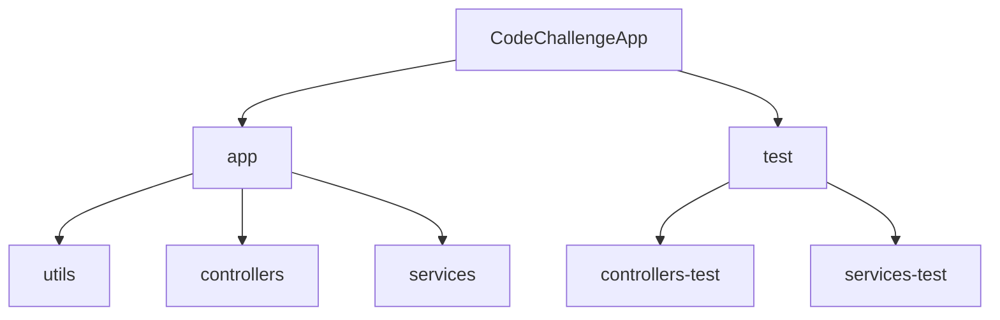
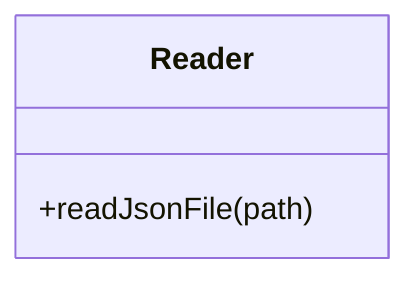
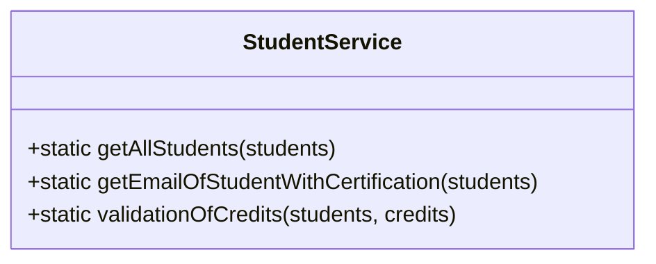
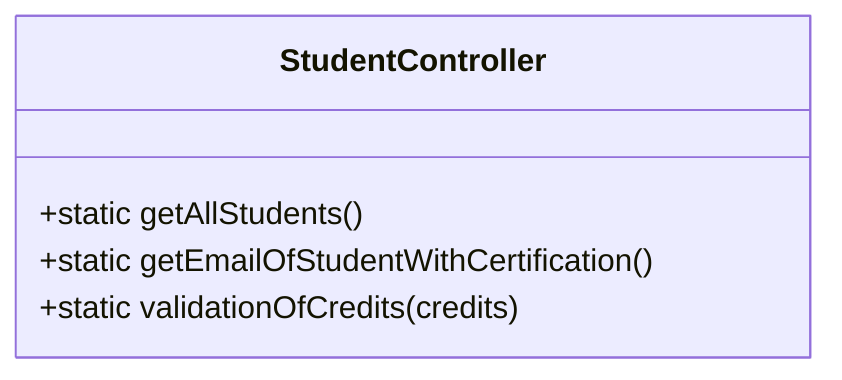
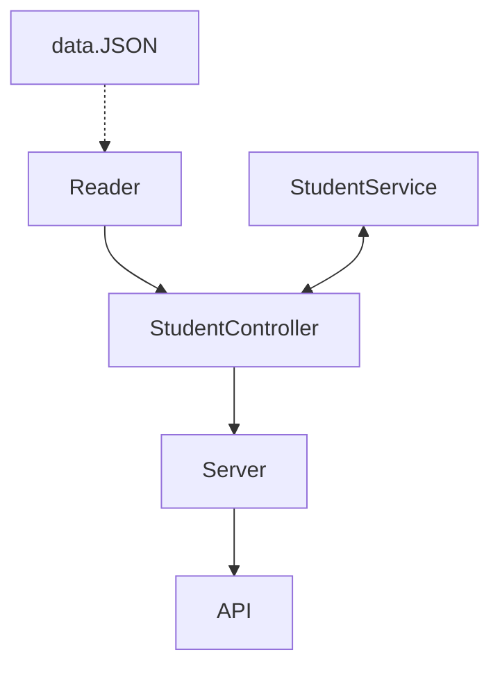

# CodeChallengeApp | Project for LaunchX by OmarVentura.

## Requerimentos Code Challenge (Semana 4)

1. Habilitar un endpoint para consultar todos los estudiantes con todos sus campos.
2. Habilitar un endpoint para consultar los emails de todos los estudiantes que tengan certificación `haveCertification`.
3. Habilitar un endpoint para consultar todos los estudiantes que tengan `credits` mayor a 500.

## Creación del proyecto
```
npm init
```

## Dependencias usadas crear el proyecto

 - `Jest 28.0.3`:  Dependencia Jest para Pruebas de unidad, eso permitirá validar el correcto funcionamiento de los diferentes módulos en la aplicación, se inicia con el   `npm install --save-dev jest` y se añade al `package.json` los scripts necesarios.
 - `Express 4.18.1`: Express lo utilizamos para crear la aplicación y poder correrla en el entorno NODE.JS con un servidor en `localhost` para integrar nuestros módulos y que sean funcionales.
 - `ESLint 8.14.0`:  La herramienta Linter la utilizamos para ayudarnos a cuidar la legibilidad en nuestro código y estilizarla de la mejor manera.
 - `test.yml`:  Automatización de Pruebas de Unidad para `GitHub Actions`, el cual genera una acción para indicarnos si todo está correcto en nuestro código.

## Estructura de directorio de App


Separamos los directorios para tener una estructura, separar las responsabilidades, los cuales estructuramos de la siguiente forma:

#### Carpeta `app`

- Carpeta `utils`: Aquí tenemos un archivo `Reader.js` con una clase auxiliar `fs` en el cual se crea la clase `Reader` que inspecciona el `data.json` y lo exporta para su uso.

- Carpeta `services`: Tenemos un archivo `studentService.js` en el cual se crea una clase llamada `StudentService` para realizar toda la lógica que se necesita y exportala, alli creamos métodos estáticos para los requerimientos, los cuales son:
    - `static getAllStudents(students)` - Con este método retornamos la lista de los estudiantes del archivo `data.json`.
    - `static getEmailOfStudentWithCertification(students)` - Con este método retornamos la lista de los emails del archivo `data.json` para aquellos estudiantes que tengan certificación.
    - `static validationOfCredits(students, credits)` - Con este método retornamos la lista de los estudiantes del archivo `data.json` para aquellos que tengan creditos igual o mayores a 500, de lo contrario retorna un error.

- Carpeta `controllers`: En esta carpeta tenemos un archivo `studentController.js` para uso de exclusivo de `StudentService`, se crea en el archivo una clase llamada `StudentController` en el cual se crea metodos estáticos para conectar el API y el Servidor, importamos las clases `Reader` y `StudentService`, además de exportar el módulo. Los métodos creados son los siguientes:
    - `static getAllStudents()` - Con este método retornamos la lista de los estudiantes del archivo `data.json`.
    - `static getEmailOfStudentWithCertification()` - Con este método conectamos el archivo `data.json` con `studentService`para los estudiantes que tengan certificación.
    - `static validationOfCredits(credits)` - Con este método conectamos el archivo `data.json` con `studentService` para los estudiantes con creditos.

#### Carpeta `test`
- Carpeta `services`: Tenemos un archivo `studentService.test.js` con 3 pruebas que validan el requerimiento.
- Carpeta `controllers`: En esta carpeta tenemos un archivo `studentController.test.js` con pruebas que validan los datos recibidos desde el archivo `JSON` y serán los que recibirá el `Server`.

#### Archivo `data.json`
- La db en el archivo `data.json` se tomo de la lista de estudiantes de <a href="https://gist.github.com/carlogilmar/1f5164637fb77aecef3b9e6b9e2a9b63">Visual Partner-Ship</a>

### Diseño de todos los componentes de la app


### Archivo `server.js`
    - En el archivo se crea el servidor con Express, en el cual se crean los endpoints para los diferentes requerimientos, con `app.get`.

#### Funcionalidad:

| Endpoint | Request | Response |
|---|---|---|
| `localhost:3000/v1/students` | `localhost:3000/v1/students` | Deberás obtener la lista de estudiantes de Visual Partners |
| `localhost:3000/v1/students/certified` | `localhost:3000/v1/students/certified` | Se obtienen los emails de los estudiantes que tienen certificacion |
| `localhost:3000/v1/students/credits/:credits` | `localhost:3000/v1/students/credits/500` | Deberás obtener la lista de usernames con mas de 500 creditos |

#### Ejemplo:


