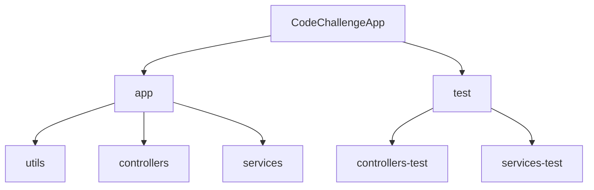
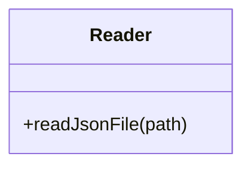
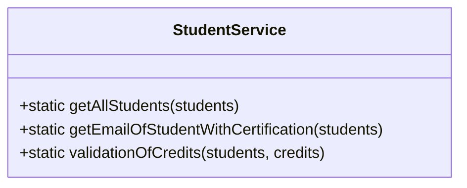
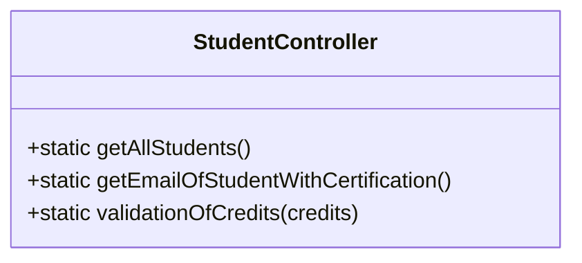
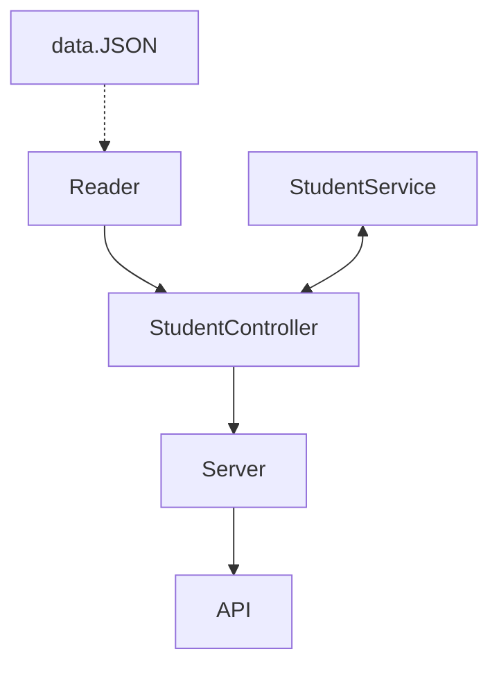

# CodeChallengeApp | Project for LaunchX by OmarVentura.

## Tabla de Contenidos
1. [Requerimentos Code Challenge](#id1)
2. [Creación del proyecto](#id2)
3. [ependencias usadas crear el proyecto](#id3)
4. [Estructura de directorio de App](#id4)
5. [Archivos `app`](#id5)
6. [Archivos `test`](#id6)
7. [Archivo `data.json`](#id7)
8. [Diseño de todos los componentes de la app](#id8)
9. [Archivo `server.js`](#id9)
10. [Ejemplo (server)](#id10)
11. [Como clonar Repo y correrlo de manera local](#id11)

## Requerimentos Code Challenge (Semana 4)<a name="id1"></a>

1. Habilitar un endpoint para consultar todos los estudiantes con todos sus campos.
2. Habilitar un endpoint para consultar los emails de todos los estudiantes que tengan certificación `haveCertification`.
3. Habilitar un endpoint para consultar todos los estudiantes que tengan `credits` mayor a 500.

## Creación del proyecto<a name="id2"></a>
```
npm init -y
```

## Dependencias usadas crear el proyecto<a name="id3"></a>

 - `Jest 28.0.3`:  Dependencia Jest para Pruebas de unidad, eso permitirá validar el correcto funcionamiento de los diferentes módulos en la aplicación, se inicia con el   `npm install --save-dev jest` y se añade al `package.json` los scripts necesarios.
   * <a href="https://jestjs.io/es-ES/docs/next/getting-started" > Documentación `jest`</a>
 - `Express 4.18.1`: Express lo utilizamos para crear la aplicación y poder correrla en el entorno NODE.JS con un servidor en `localhost` para integrar nuestros módulos y que sean funcionales.
   * <a href="https://devdocs.io/express/starter/installing" > Documentación `Express`</a>
 - `ESLint 8.14.0`:  La herramienta Linter la utilizamos para ayudarnos a cuidar la legibilidad en nuestro código y estilizarla de la mejor manera.
   * <a href="https://eslint.org/docs/user-guide/getting-started" > Documentación `ESLint`</a>
 - `test.yml`:  Automatización de Pruebas de Unidad para `GitHub Actions`, el cual genera una acción para indicarnos si todo está correcto en nuestro código.
   * <a href="https://docs.github.com/es/actions/using-workflows/workflow-syntax-for-github-actions" > Documentación GitHub Actions `test.yml`</a>

## Estructura de directorio de App<a name="id4"></a>


Separamos los directorios para tener una estructura, separar las responsabilidades, los cuales estructuramos de la siguiente forma:

#### Carpeta `app`<a name="id5"></a>

- Carpeta `utils`: Aquí tenemos un archivo `Reader.js` con una clase auxiliar `fs` en el cual se crea la clase `Reader` que inspecciona el `data.json` y lo exporta para su uso.

- Carpeta `services`: Tenemos un archivo `studentService.js` en el cual se crea una clase llamada `StudentService` para realizar toda la lógica que se necesita y exportala, alli creamos métodos estáticos para los requerimientos, los cuales son:
    - `static getAllStudents(students)` - Con este método retornamos la lista de los estudiantes del archivo `data.json`.
    - `static getEmailOfStudentWithCertification(students)` - Con este método retornamos la lista de los emails del archivo `data.json` para aquellos estudiantes que tengan certificación.
    - `static validationOfCredits(students, credits)` - Con este método retornamos la lista de los estudiantes del archivo `data.json` para aquellos que tengan creditos igual o mayores a 500, de lo contrario retorna un error.

- Carpeta `controllers`: En esta carpeta tenemos un archivo `studentController.js` para uso de exclusivo de `StudentService`, se crea en el archivo una clase llamada `StudentController` en el cual se crea metodos estáticos para conectar el API y el Servidor, importamos las clases `Reader` y `StudentService`, además de exportar el módulo. Los métodos creados son los siguientes:
    - `static getAllStudents()` - Con este método retornamos la lista de los estudiantes del archivo `data.json`.
    - `static getEmailOfStudentWithCertification()` - Con este método conectamos el archivo `data.json` con `studentService`para los estudiantes que tengan certificación.
    - `static validationOfCredits(credits)` - Con este método conectamos el archivo `data.json` con `studentService` para los estudiantes con creditos.

#### Carpeta `test`<a name="id6"></a>
- Carpeta `services`: Tenemos un archivo `studentService.test.js` con 3 pruebas que validan el requerimiento.
  * Prueba 1 - Se reciben datos de todos los estudiantes con `getAllStudents()`. 
  * Prueba 2 - Se reciben datos de los estudiantes con certificacion con `getEmailOfStudentWithCertification()`.
  * Prueba 3 - Se reciben datos de los estudiantes con creditos `validationOfCredits(credits)`.
- Carpeta `controllers`: En esta carpeta tenemos un archivo `studentController.test.js` con pruebas que validan los datos recibidos desde el archivo `JSON` y serán los que recibirá el `Server`.
  * Prueba 1 - Se reciben datos de todos los estudiantes con `getAllStudents()`. 
  * Prueba 2 - Se reciben datos de los estudiantes con certificacion con `getEmailOfStudentWithCertification()`.
  * Prueba 3 - Se reciben solo los datos de los estudiantes con creditos iguales o mayores a 500 con creditos `validationOfCredits(credits)`.
#### Archivo `data.json`<a name="id7"></a>
- La db en el archivo `data.json` se tomo de la lista de estudiantes de <a href="https://gist.github.com/carlogilmar/1f5164637fb77aecef3b9e6b9e2a9b63">Visual Partner-Ship</a>

### Diseño de todos los componentes de la app<a name="id8"></a>


### Archivo `server.js`<a name="id9"></a>
    - En el archivo se crea el servidor con Express, en el cual se crean los endpoints para los diferentes requerimientos, con `app.get`.

#### Funcionalidad:

| Endpoint | Request | Response |
|---|---|---|
| `localhost:3000/v1/students` | `localhost:3000/v1/students` | Deberás obtener la lista de estudiantes de Visual Partners |
| `localhost:3000/v1/students/certified` | `localhost:3000/v1/students/certified` | Se obtienen los emails de los estudiantes que tienen certificacion |
| `localhost:3000/v1/students/credits/:credits` | `localhost:3000/v1/students/credits/500` | Deberás obtener la lista de usernames con mas de 500 creditos |

#### Ejemplo:<a name="id10"></a>


## Como clonar Repo y correrlo de manera local<a name="id11"></a>
* Primero debes ubicarte en la página principal del repositorio <a href="https://github.com/OmarVenturaP/CodeChallengeApp">CodeChallenge</a>.
* Al estar en la página principal del Repositorio debes ubicarte en Clone y copiar el link de acceso al repo:


* Posteriormente debes abrir la linea de comandos Git Bash e ingresar el comando y el link al repo
```
git clone https://github.com/OmarVenturaP/CodeChallengeApp
```
* Una vez clonado el repo de manera local, debes instalar las dependencias necesarias dentro de este proyecto, para ello ejecuta:
```
npm install
```
* Posteriormente ejecuta el servidor para validar su correcto funcionamiento:
```
node app/server.js
```
* Para que puedas validar los datos enviados por el servidor puedes seguir los pasos <a href="1d9">aqui</a> recomendados.
<hr>
